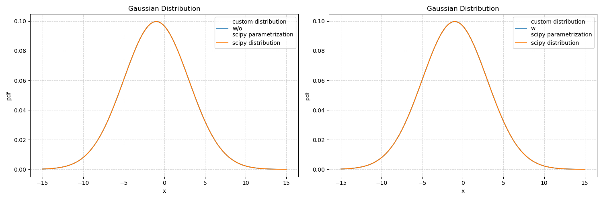
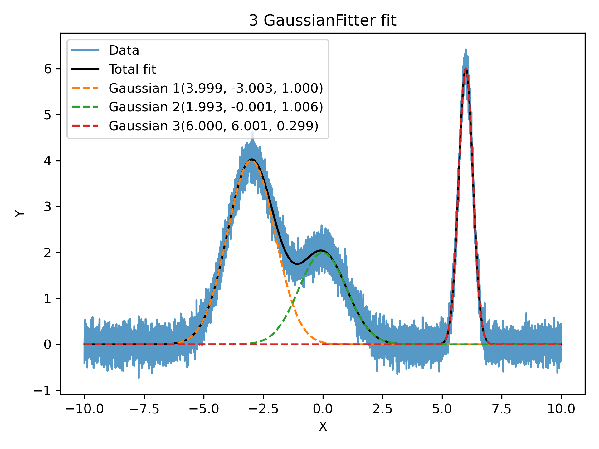
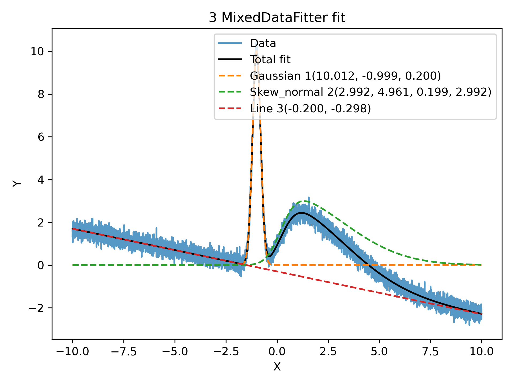

# Summary

`pyMultiFit` is an open-source Python library that streamlines multi-model curve fitting for scientific applications.
It provides a uniform API for both statistical and non-statistical models, with built-in support for common
distributions such as Gaussian, Laplace, SkewedNormal, LogNormal, and Exponential.
The library emphasizes extensibility through a lightweight `BaseFitter` interface, enabling users to define custom
models with minimal boilerplate.
In addition to fitting, `pyMultiFit` includes utilities for synthetic data generation and integrated statistical tools for
constructing synthetic datasets.

[//]: # (While most built-in fitters target homogeneous data, `pyMultiFit` also includes a `MixedDataFitter` that enables the simultaneous fitting of heterogeneous models &#40;e.g., Gaussian + SkewNormal + Linear&#41;, making it especially useful for applications in signal analysis, spectral modeling, and other multi-component workflows.)

Together, these features make `pyMultiFit` especially well-suited for researchers working with **signals**, **spectra**,
or **experimental datasets** where multiple overlapping components are common.

# Statement of Need

Data fitting is a cornerstone of experimental and analytical workflows across the sciences.
Yet, widely used scientific libraries such as `numpy`[@harris2020array] and `scipy` [@virtanen2020scipy] provide only
limited functionality for fitting **multiple models or model mixtures** concurrently.
Researchers working with multi-component fits—common in domains such as signal analysis, spectroscopy, and high-energy
physics—are often required to implement complex and repetitive boilerplate code to manage these workflows.

Several modern libraries have been developed to extend beyond these limitations.
For example, `zfit` [@zfit2019] leverages `tensorflow` [@tensorflow2016] to support high-performance statistical
fitting, `pyAutoFit` [@pyautofit2021] facilitates hierarchical model construction, and specialized
`Mixture-Models` [@MM2024] packages provide probabilistic mixture fitting.
While powerful, these tools are either tightly bound to heavy backends, optimized for niche applications, or difficult
to adapt for general multimodel curve-fitting tasks.

`pyMultiFit` addresses this gap by providing a lightweight and extensible framework dedicated to multi-model fitting.
It offers built-in support for combining multiple models, generating synthetic datasets, and incorporating user-defined
models with minimal effort.
By streamlining multi-component fitting workflows, `pyMultiFit` enables researchers to more rapidly explore, test, and
refine fitting strategies without the overhead of custom infrastructure.

# Modules

The `pyMultiFit` library is organized into three main modules:

1. **`distributions`**  
   Provides classes for statistical distributions, including common implementations such as Gaussian and Laplace via the
   `utilities_d` script.
    - Custom distributions can be defined by subclassing the `BaseDistribution` class. At minimum, users must implement
      the distribution formula in the `pdf` method.
    - For convenience, statistical distributions can also be instantiated using the `from_scipy_params` class method,
      which accepts the same parameter names as `scipy.stats`.

2. **`fitters`**  
   Provides classes for fitting models to data.
    - Custom fitters can be created by subclassing the `BaseFitter` class.
    - Fitters can handle multiple use cases of the same model.
    - The `MixedDataFitter` class is included for fitting multiple models to heterogeneous datasets.

3. **`generators`**  
   Provides tools for generating synthetic datasets.
    - Generators can accept subclasses of `BaseDistribution` through a dictionary interface, enabling flexible model
      generation.
    - A key utility is the `multiple_models` function which enables heterogeneous model data generation using
      `BaseDistribution` subclasses.

# Highlights

`pyMultiFit` provides a consistent API for custom distributions, multi-model data generation, and heterogeneous fitting workflows.  
This section highlights key features of the library with illustrative examples and figures.

1. **Custom and `scipy`-compatible distributions**  

Users can define distributions by subclassing `BaseDistribution` or use the familiar `scipy.stats` parameterization. Figure 1 shows the comparison between a custom Gaussian distribution implemented in `pyMultiFit` and the equivalent `scipy.stats` distribution.

```python
import numpy as np
import scipy.stats as ss
from matplotlib import pyplot as plt

from pymultifit.distributions import GaussianDistribution

x = np.linspace(-15, 15, 100)

custom_distribution = GaussianDistribution(mu=-1, std=4, normalize=True).pdf(x)

scipy_distribution = ss.norm(loc=-1, scale=4).pdf(x)
custom_with_scipy = GaussianDistribution.from_scipy_params(loc=-1, 
                                                           scale=4).pdf(x)

f, ax = plt.subplots(1, 2, figsize=(15, 5))
ax[0].plot(x, custom_distribution, 
           label='custom distribution\nw/o\nscipy parametrization')
ax[0].plot(x, scipy_distribution, 
           label='scipy distribution')
ax[0].set_xlabel('x')
ax[0].set_ylabel('pdf')
ax[0].set_title('Gaussian Distribution')
ax[0].grid(True, alpha=0.5, ls='--')
ax[0].legend(loc='best')

ax[1].plot(x, custom_with_scipy, 
           label='custom distribution\nw\nscipy parametrization')
ax[1].plot(x, scipy_distribution, 
           label='scipy distribution')
ax[1].set_xlabel('x')
ax[1].set_ylabel('pdf')
ax[1].set_title('Gaussian Distribution')
ax[1].grid(True, alpha=0.5, ls='--')
ax[1].legend(loc='best')

plt.tight_layout()
plt.savefig('./distribution_.png')

plt.show()
```

Figure 1: Comparison of the pdf of a Gaussian distribution with and without scipy parametrization.

2. Flexible tools for generating synthetic datasets and fitting multiple models.

Flexible tools allow researchers to generate synthetic datasets with multiple components and fit them with minimal boilerplate.
Figure 2 demonstrates the fitting of a 3-component Gaussian mixture using `pyMultiFit`, with both individual components and the composite model shown.

```python
import matplotlib.pyplot as plt
import numpy as np

from pymultifit.fitters import GaussianFitter
from pymultifit.generators import multi_gaussian

# x-data
x = np.linspace(-10, 10, 10_000)

# parameters for the 3-component gaussian model
amp = np.array([4, 2, 6])
mu = np.array([-3, 0, 6])
std = np.array([1, 1, 0.3])

# stacking the parameters into a single array
params = np.column_stack([amp, mu, std])

# data generation
mg_data = multi_gaussian(x, params, noise_level=0.2, normalize=False)

# guess for the parameters
# note that the order of the parameters must match the order of the 
# parameters in the distribution class
amp_guess = np.array([3, 1, 4])
mu_guess = np.array([-2, 0, 5])
std_guess = np.array([1, 0.5, 0.5])

# stacking the parameters into a single array
params_guess = np.column_stack([amp_guess, mu_guess, std_guess])

# initializing fitter with the data
mg_fitter = GaussianFitter(x, mg_data)

# fitting the model
mg_fitter.fit(params_guess)

# plotting the fitted model
mg_fitter.plot_fit(show_individuals=True)
plt.show()
```

Figure 2: Example of a 3-component Gaussian model fit using the `GaussianFitter`.

3. Flexible API for generating and fitting heterogeneous datasets.

The MixedDataFitter enables simultaneous fitting of heterogeneous models (e.g., Gaussian + SkewNormal + Linear), useful in complex workflows such as spectral modeling.
Figure 3 illustrates a combined Gaussian, SkewNormal, and Linear model fit.

```python
import matplotlib.pyplot as plt
import numpy as np

from pymultifit.distributions.utilities_d import (gaussian_pdf_,
                                                  skew_normal_pdf_, line)
from pymultifit.fitters import (MixedDataFitter, GaussianFitter,
                                SkewNormalFitter, LineFitter)
from pymultifit.generators import multiple_models

x = np.linspace(-10, 10, 10_000)

gauss = (10, -1, 0.2)
skewNorm = (3, 5, 0.2, 3)
lineParams = (-0.2, -0.3)

params = [gauss, skewNorm, lineParams]

mixed_data = multiple_models(x, params,
                             model_list=['G', 'Sk', 'L'],
                             mapping_dict={'G': gaussian_pdf_,
                                           'Sk': skew_normal_pdf_,
                                           'L': line},
                             noise_level=0.2)

guess = [(8, 0, 1), (8, 3, 0, 2), (1, 0)]

mixed_fitter = MixedDataFitter(x, mixed_data, model_list=['G', 'Sk', 'L'],
                               model_dictionary={'G': GaussianFitter,
                                                 'Sk': SkewNormalFitter,
                                                 'L': LineFitter})
mixed_fitter.fit(guess)
mixed_fitter.plot_fit(show_individuals=True)
plt.show()
```

Figure 3: Demonstration of the MixedDataFitter for fitting heterogeneous models.
